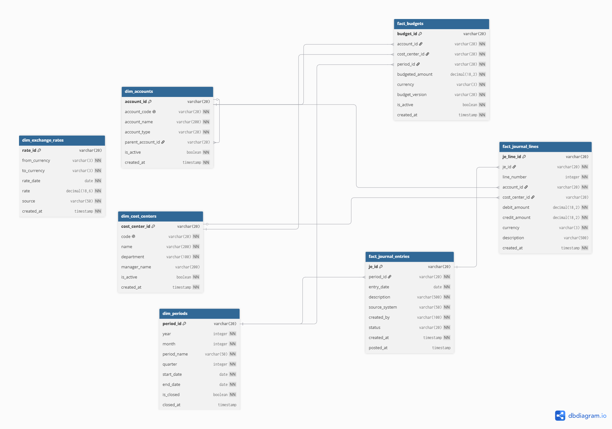
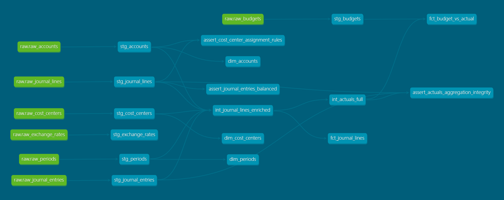

# FinClose AI

**Automated Financial Close & Variance Analysis Platform**

End-to-end data pipeline that automates the monthly financial close process and generates AI-powered executive variance analysis.

## The Problem

Finance teams at mid-size companies spend 3-5 days each month manually:
- Reconciling accounts and journal entries
- Calculating budget vs. actual variances
- Writing executive commentary on those variances
- Producing financial reports in Excel

This process is slow, error-prone, and pulls senior finance analysts away from higher-value work.

## The Solution

FinClose AI automates the entire workflow:

1. **Ingests** journal entries, budgets, and chart of accounts data
2. **Transforms** raw accounting data into dimensional models (fact tables, dimensions)
3. **Calculates** P&L statements and budget variances automatically
4. **Generates** executive-level variance commentary using AI
5. **Visualizes** results in an interactive dashboard

The goal: reduce a 3-5 day manual close to a 30-minute automated process.

## Architecture

The pipeline follows a modern modular data stack:

**1. Ingestion Layer** — Python scripts using Faker generate realistic synthetic accounting data.

**2. Storage Layer** — DuckDB serves as the analytical warehouse during development. Snowflake validation planned for week 16.

**3. Transformation Layer** — dbt models data in three layers: staging, intermediate, and marts. Includes 92 automated data tests.

**4. Orchestration Layer** — Apache Airflow orchestrates the pipeline on a monthly schedule with automatic retries, timeouts, and failure callbacks.

**5. Consumption Layer** — Two parallel outputs:
   - **Streamlit dashboard** with 5 pages for interactive exploration
   - **LangChain + OpenAI** agent that generates variance commentary in natural language

---

## Tech Stack

| Layer | Technology |
|-------|------------|
| **Language** | Python 3.10 |
| **Dependency Management** | Poetry |
| **Data Generation** | Faker |
| **Warehouse (dev)** | DuckDB |
| **Warehouse (validation)** | Snowflake |
| **Transformation** | dbt-core 1.11.11 + dbt-duckdb 1.10.1 |
| **Orchestration** | Apache Airflow 3.1.1 |
| **Dashboard** | Streamlit + Plotly |
| **AI Layer** | LangChain + OpenAI gpt-4o-mini |
| **Containerization** | Docker Compose |
| **Environment** | WSL2 / Ubuntu 22.04 |

---

## Data Model

The pipeline operates on a dimensional data model with 7 tables (4 dimensions + 3 facts).



See [`docs/data_model.md`](./docs/data_model.md) for full details.

---

## Data Pipeline (dbt)

The transformation layer follows a 3-layer architecture: staging, intermediate, and marts.



### Pipeline metrics

| Metric | Value |
|--------|-------|
| dbt models | 14 |
| dbt data tests | 92 |
| Python unit tests | 51 (84% coverage) |
| Synthetic rows | 23,000+ |

---

## Project Roadmap

- [x] Week 1: Environment setup and project scaffolding
- [x] Week 2: Accounting data model design
- [x] Weeks 3-4: Synthetic data generation with Python + Faker
- [x] Weeks 5-7: dbt staging and intermediate models
- [x] Weeks 8-9: dbt marts and data quality tests
- [x] Weeks 10-11: Airflow orchestration and Streamlit dashboard
- [x] Weeks 12-14: LangChain-based AI variance analysis agent
- [ ] Weeks 15-16: Snowflake validation and final documentation

---

## Getting Started

### Prerequisites

- Linux / macOS / WSL2 (Ubuntu 22.04)
- Python 3.10+
- Poetry
- Docker (for Airflow)

### Quick start (manual)

```bash
git clone https://github.com/CarlosLeguiz/finclose-ai.git
cd finclose-ai
poetry install
cp .env.example .env
poetry run python -m data_generator.main
poetry run python -m data_generator.load_to_duckdb
cd dbt_project
poetry run dbt build
```

### Running with Airflow

```bash
cd airflow
docker compose build
docker compose up -d
# Access UI at http://localhost:8080 (airflow / airflow)
docker compose down
```

The DAG `finclose_pipeline` runs 5 sequential tasks with automatic retries, timeouts, and failure callbacks. See [`docs/decisions/0005-orchestrate-pipeline-with-airflow.md`](./docs/decisions/0005-orchestrate-pipeline-with-airflow.md).

### Running the dashboard

```bash
poetry run streamlit run dashboard/Summary.py
```

---

## Project Structure
finclose-ai/

├── data_generator/      # Synthetic data generation + DuckDB loader

├── dbt_project/         # 14 dbt models with 92 data tests

├── airflow/             # Airflow DAG, Dockerfile, docker-compose

├── dashboard/           # Streamlit dashboard (5 pages)

├── ai_layer/            # LangChain SQL agent

├── data/                # Local data files (gitignored)

├── docs/                # Documentation and ADRs

└── tests/               # 51 pytest unit tests

## About

Built by **Carlos Leguizamon Guillaumet** as a portfolio project combining accounting expertise (CPA background) with modern data engineering and AI.

- Córdoba, Argentina
- [LinkedIn](https://www.linkedin.com/in/carlos-guillaumet)
- carlosleguizamonguillaumet1998@gmail.com

---

## License

MIT
